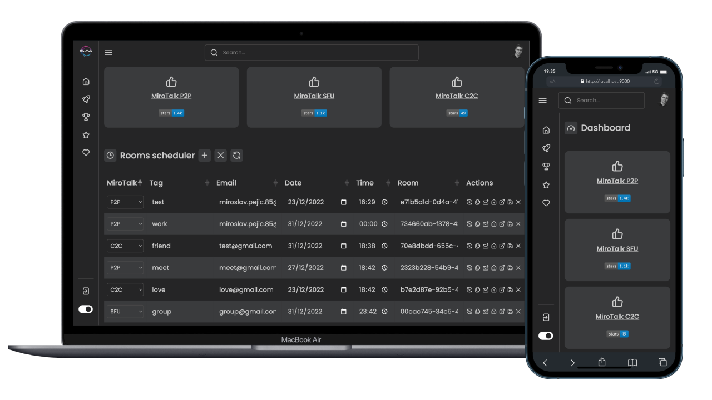

# <p align="center">MiroTalk WebRTC Admin</p>

<p align="center">Manage and scheduling all the MiroTalk's WebRTC rooms:</p>

---

-   [MiroTalk P2P](https://github.com/miroslavpejic85/mirotalk) - `Peer to peer` real-time video conferences, optimized for small groups (5-8 participants)

-   [MiroTalk SFU](https://github.com/miroslavpejic85/mirotalksfu) - `Selective forwarding unit` real-time video conferences, optimized for large groups (8+ participants)

-   [MiroTalk C2C](https://github.com/miroslavpejic85/mirotalkc2c) - `Cam to cam` (peer to peer) real-time video conferences, optimized for one to one (2 participants)

---



<details open>
<summary>Quick start</summary>

<br/>

Install [NodeJs](https://nodejs.org/en/blog/release/v16.15.1/).

```bash
# Copy .env.template to .env and edit it
$ cp .env.template .env
```

Change the [MONGO](https://www.mongodb.com/) `URL & DATABASE`, with your own:

```bash
MONGO_URL=mongodb://${MONGO_USERNAME}:${MONGO_PASSWORD}@${MONGO_HOST}:${MONGO_PORT}
MONGO_DATABASE=mirotalk
```

Setup your email and [app password](https://support.google.com/mail/answer/185833?hl=en):

```bash
EMAIL_HOST=emailHost
EMAIL_PORT=emailPort
EMAIL_USERNAME=emailUsername
EMAIL_PASSWORD=emailPassword
```

```bash
# Install dependencies
$ npm install
# Start the server
$ npm start
```

Open in browser: http://localhost:9000

</details>

<details open>
<summary>Docker</summary>

<br/>


Install [docker](https://docs.docker.com/engine/install/) and [docker-compose](https://docs.docker.com/compose/install/).

```bash
# Copy .env.template to .env and edit it
$ cp .env.template .env
# Build or rebuild services
$ docker-compose build
# Create and start containers (-d as daemon)
$ docker-compose up
```

[Docker official image](https://hub.docker.com/r/mirotalk/webrtc)

</details>

<details>
<summary>API</summary>

<br/>

You can check the swagger document at http://localhost:9000/api/v1/docs, or live [here](https://webrtc.mirotalk.com/api/v1/docs).

</details>

<details>
<summary>Self hosting</summary>

<br/>

To self-hosting MiroTalk WEB, just follow [this steps](./SelfHosting.md).

</details>

<details>

<summary>Discussions</summary>

<br/>

Join with us on [Discord](https://discord.gg/rgGYfeYW3N), ask questions and post answers without opening issues.

</details>

<details open>
<summary>Support</summary>

<br/>

You can support MiroTalk's projects by [sponsoring](https://github.com/sponsors/miroslavpejic85) it. Thanks!

</details>

<details>
<summary>License</summary>

<br/>


MiroTalk is free and can be modified and forked. But the conditions of the AGPLv3 (GNU Affero General Public License v3.0) need to be respected. In particular modifications need to be free as well and made available to the public. Get a quick overview of the license at [Choose an open source license](https://choosealicense.com/licenses/agpl-3.0/).

For a MiroTalk license under conditions other than AGPLv3, please contact us at license.mirotalk@gmail.com or [purchase directly via CodeCanyon](https://codecanyon.net/item/a-selfhosted-mirotalks-webrtc-rooms-scheduler-server/42643313).

Thank you!

</details>
