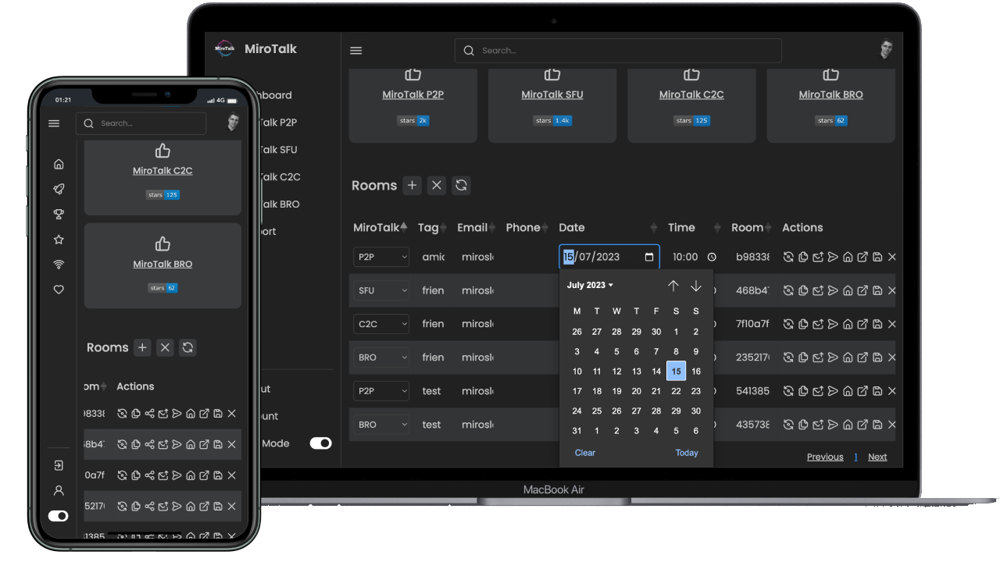

<h1 align="center">MiroTalk WebRTC</h1>

<br />

<div align="center">

<a href="">[](https://www.linkedin.com/in/miroslav-pejic-976a07101/)</a>
<a href=""></a>
<a href="">[](https://discord.gg/rgGYfeYW3N)</a>

</div>

<p align="center">
MiroTalk WEB is a platform that allows for the management of an unlimited number of users. Each user must register with their email, username, and password, after which they gain access to their personal dashboard. Within the dashboard, users can manage their rooms and schedule meetings using the desired version of MiroTalk on a specified date and time. Invitations to these meetings can be sent via email, shared through the web browser, or sent via SMS.
</p>

<hr/>

<p align="center">
    <a href="https://webrtc.mirotalk.com">Explore MiroTalk WEB</a>
</p>

---

For demonstration purposes, below the credentials:

- `Username`: demo
- `Email`: demo@gmail.com
- `Password`: Demo@123

---

| `MiroTalk`                                               | Description                                                                                                                                                                                |
| -------------------------------------------------------- | ------------------------------------------------------------------------------------------------------------------------------------------------------------------------------------------ |
| 🚀 [P2P](https://github.com/miroslavpejic85/mirotalk)    | `Peer to peer` real-time video conferences, optimized for small groups. Unlimited time, unlimited concurrent rooms each having 5-8 participants.                                           |
| 🏆 [SFU](https://github.com/miroslavpejic85/mirotalksfu) | `Selective forwarding unit` real-time video conferences, optimized for large groups. Unlimited time, unlimited concurrent rooms each having 8+ participants.                               |
| ✨ [C2C](https://github.com/miroslavpejic85/mirotalkc2c) | `Cam to cam` (peer to peer) real-time video conferences, optimized for one to one. Unlimited time ,unlimited concurrent rooms each having 2 participants.                                  |
| 📡 [BRO](https://github.com/miroslavpejic85/mirotalkbro) | `Live broadcast` (peer to peer) live video, audio and screen stream to all connected users (viewers). Unlimited time, unlimited concurrent rooms each having a broadcast and many viewers. |

<br>



<hr />

<p align="center">
    Join our community for questions, discussions, and support on <a href="https://discord.gg/rgGYfeYW3N">Discord</a>
</p>

<hr />

<details open>
<summary>Quick start</summary>


Install [NodeJs](https://nodejs.org/en/blog/release/v18.16.0).

```bash
# The project was tested with node version 18.16.0. So make sure to update the node version using nvm if you have multiple version installed.
# After updating the node version, you can verify using
$ node --version # v18.16.0

# Clone the project repo
$ git clone https://github.com/miroslavpejic85/mirotalkwebrtc.git

# Go to project dir
$ cd mirotalkwebrtc

# Copy .env.template to .env and customize it according to your needs
$ cp .env.template .env

# Copy config.template.js to config.js and customize it according to your needs
$ cp backend/config.template.js backend/config.js
```

---

### MongoDb


#### Local MongoDB Deployment

To run MongoDB locally with [Docker Compose](https://docs.docker.com/compose/install/), you can use the following commands:

Start the MongoDB container:

```bash
$ npm run mongo:up
```

Stop the MongoDB container:

```bash
$ npm run mongo:down
```

<details>
<summary>Cloud MongoDB Deployment (Optional)</summary>

<br />

For cloud MongoDB deployments, such as with <a href="https://www.mongodb.com/">MongoDB Atlas</a>, make sure to update the credentials in the `.env` file accordingly.

```bash
# MongoDB Configuration (https://www.mongodb.com/)
MONGO_URL=mongodb://${MONGO_USERNAME}:${MONGO_PASSWORD}@${MONGO_HOST}:${MONGO_PORT}
MONGO_DATABASE=mirotalk
```

</details>

<details>
<summary>User Email Verification (Optional)</summary>

<br />


By default, email verification is disabled. To enable it, set `EMAIL_VERIFICATION` to `true` in the `.env` file, and ensure the email settings are properly configured.

```bash
# Email Configuration (https://support.google.com/mail/answer/185833?hl=en)
EMAIL_VERIFICATION=true
EMAIL_HOST=emailHost
EMAIL_PORT=emailPort
EMAIL_USERNAME=emailUsername
EMAIL_PASSWORD=emailPassword
```

</details>

### Install dependencies and start the server

```bash
# Install dependencies
$ npm install

# Start the server
$ npm start
```

Open in browser: [http://localhost:9000](http://localhost:9000)

</details>

<details open>
<summary>Docker</summary>

<br/>


Repository: [Docker hub](https://hub.docker.com/r/mirotalk/webrtc)

Install [docker](https://docs.docker.com/engine/install/) and [docker-compose](https://docs.docker.com/compose/install/).

```bash
# Clone the project repo
$ git clone https://github.com/miroslavpejic85/mirotalkwebrtc.git
# Go to project dir
$ cd mirotalkwebrtc
# Copy .env.template to .env and edit it
$ cp .env.template .env
# Copy config.template.js to config.js and edit it
$ cp backend/config.template.js backend/config.js
# Copy docker-compose.template.yml in docker-compose.yml and edit it if needed
$ cp docker-compose.template.yml docker-compose.yml
# Get official image from Docker Hub
$ docker pull mirotalk/webrtc:latest
# Create and start containers (-d as daemon)
$ docker-compose up
```

Open in browser: [http://localhost:9000](http://localhost:9000)

</details>

<details>
<summary>Documentations</summary>

<br>

- `MongoDB Migrations:` For MongoDB migrations follow [this README](./database/README.md).

- `Ngrok:` You can start MiroTalk WEB directly from your local PC and make it accessible from any device outside your network by following [these instructions](docs/ngrok.md).

- `Self-hosting:` For `self-hosting MiroTalk WEB` on your own dedicated server, please refer to [this comprehensive guide](https://docs.mirotalk.com/mirotalk-web/self-hosting/). It will provide you with all the necessary instructions to get your MiroTalk WEB instance up and running smoothly.

- `Rest API:` You can check the swagger document at http://localhost:9000/api/v1/docs, or live [here](https://webrtc.mirotalk.com/api/v1/docs).

</details>

<details open>
<summary>Hetzner & Contabo</summary>

<br/>

[](https://hetzner.cloud/?ref=XdRifCzCK3bn)

This application is running for `demonstration purposes` on [Hetzner](https://www.hetzner.com/), one of `the best` [cloud providers](https://www.hetzner.com/cloud) and [dedicated root servers](https://www.hetzner.com/dedicated-rootserver).

---

Use [my personal link](https://hetzner.cloud/?ref=XdRifCzCK3bn) to receive `€⁠20 IN CLOUD CREDITS`.

---

[](https://www.dpbolvw.net/click-101027391-14462707)

Experience also top-tier German web hosting – dedicated servers, VPS, and web hosting at `unbeatable prices`. Reliable, secure, and backed by 24/7 support. [Explore now here](https://www.dpbolvw.net/click-101027391-14462707)

---

To set up your own instance of `MiroTalk WEB` on a dedicated cloud server, please refer to our comprehensive [self-hosting documentation](https://docs.mirotalk.com/mirotalk-web/self-hosting/). This guide will walk you through the process step by step, ensuring a smooth and successful deployment.

</details>

<details>
<summary>Support</summary>

<br/>

You can show your support for MiroTalk's projects by considering sponsorship. By sponsoring MiroTalk on platforms like GitHub Sponsors, you can contribute to our ongoing work and help us continue to develop and improve the projects.

To support MiroTalk's projects, you can visit the sponsorship page at https://github.com/sponsors/miroslavpejic85. There, you will find the different sponsorship tiers available. You can choose a sponsorship level that suits your budget and desired level of support.

Sponsoring MiroTalk's projects not only helps us financially but also encourages our motivation and dedication to creating valuable software. Your sponsorship can enable us to allocate more time and resources towards the projects, leading to further enhancements, bug fixes, and new features.

Thank you for considering supporting MiroTalk's projects. Your sponsorship can make a positive difference and contribute to the success of our endeavors.

</details>

<details>
<summary>License</summary>

<br/>


MiroTalk WEB is free and open-source under the terms of AGPLv3 (GNU Affero General Public License v3.0). Please `respect the license conditions`, In particular `modifications need to be free as well and made available to the public`. Get a quick overview of the license at [Choose an open source license](https://choosealicense.com/licenses/agpl-3.0/).

To obtain a [MiroTalk WEB license](https://docs.mirotalk.com/license/licensing-options/) with terms different from the AGPLv3, you can conveniently make your [purchase on CodeCanyon](https://codecanyon.net/item/a-selfhosted-mirotalks-webrtc-rooms-scheduler-server/42643313). This allows you to tailor the licensing conditions to better suit your specific requirements.

</details>

---
