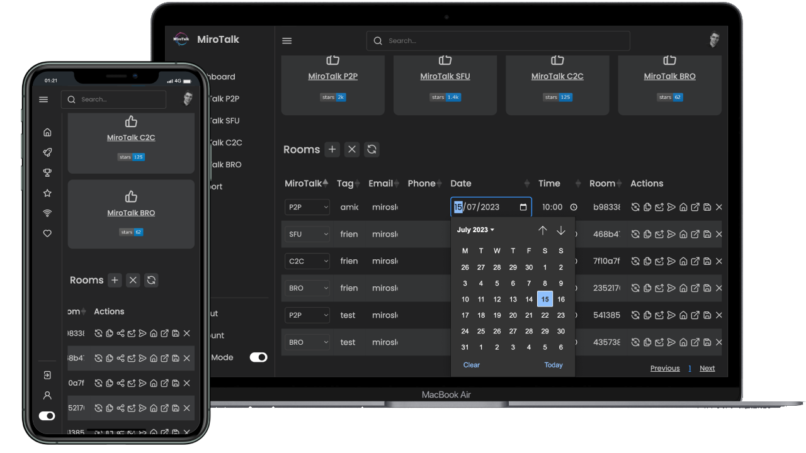
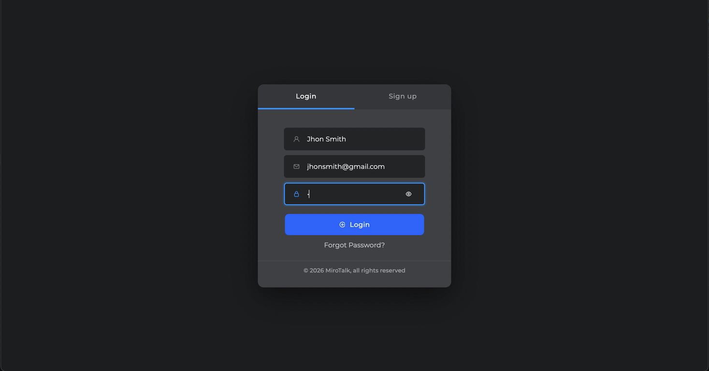

<div align="center">
    <a href="https://webrtc.mirotalk.com" target="_blank">
        
    </a>
</div>

<h1 align="center">MiroTalk WEB</h1>

<h3 align="center">
Self-hosted open-source WebRTC platform for scheduling and managing video meeting rooms across MiroTalk instances.
</h3>

<br />

<div align="center">

[](https://github.com/miroslavpejic85/mirotalkwebrtc/stargazers)
[](https://github.com/miroslavpejic85/mirotalkwebrtc/network/members)

<a href="https://choosealicense.com/licenses/agpl-3.0/"></a>
<a href="https://hub.docker.com/r/mirotalk/webrtc"></a>
<a href="https://github.com/miroslavpejic85/mirotalkwebrtc/commits/main"></a>
<a href="https://discord.gg/rgGYfeYW3N"></a>
<a href="https://www.linkedin.com/in/miroslav-pejic-976a07101/"></a>

</div>

<br />

<p align="center"><strong>MiroTalk WEB</strong> is a <strong>self-hosted, open-source</strong> platform for <strong>scheduling, managing, and organizing WebRTC video meeting rooms</strong>. It provides a personal dashboard where users can create accounts, schedule meetings for any <a href="https://docs.mirotalk.com/overview/" target="_blank">MiroTalk</a> version, and send invitations via email or shareable links.</p>

<p align="center">
    <a href="https://webrtc.mirotalk.com">Try Live Demo</a> · <a href="https://docs.mirotalk.com/mirotalk-web/self-hosting/">Documentation</a> · <a href="https://discord.gg/rgGYfeYW3N">Discord</a> · <a href="https://github.com/sponsors/miroslavpejic85">Sponsor</a>
</p>

---

<p align="center">
<code>Username</code>: demo · <code>Email</code>: demo@gmail.com · <code>Password</code>: Demo@123
</p>

---

<br />

<p align="center">
    <a href="https://webrtc.mirotalk.com">
        
    </a>
</p>

<hr />

<br />

<details open>
<summary>⚡ Quick start</summary>

<br/>

**Start in a few commands:**

```bash
git clone https://github.com/miroslavpejic85/mirotalkwebrtc.git
cd mirotalkwebrtc
cp .env.template .env
cp backend/config.template.js backend/config.js
npm install
npm run mongo:up   # start local MongoDB via Docker
npm start
```

Open [http://localhost:9000](http://localhost:9000) - done!

> **Note:** For cloud MongoDB (e.g. [MongoDB Atlas](https://www.mongodb.com/)), update the credentials in `.env` instead of running `npm run mongo:up`.

</details>

<details>
<summary>🐳 Docker</summary>

<br/>


**Prerequisites:** Install [Docker Engine](https://docs.docker.com/engine/install/) and [Docker Compose](https://docs.docker.com/compose/install/) - Image available on [Docker Hub](https://hub.docker.com/r/mirotalk/webrtc)

```bash
git clone https://github.com/miroslavpejic85/mirotalkwebrtc.git
cd mirotalkwebrtc
cp .env.template .env
cp backend/config.template.js backend/config.js
cp docker-compose.template.yml docker-compose.yml
docker-compose pull    # optional: pull official image
docker-compose up      # add -d to run in background
```

Open [http://localhost:9000](http://localhost:9000) - done!

> **Note:** Edit `.env`, `backend/config.js`, and `docker-compose.yml` to customize your setup.

</details>

<details>
<summary>📚 Documentation</summary>

<br/>

For detailed guides and references, visit the **[official documentation](https://docs.mirotalk.com)**:

- [About](https://docs.mirotalk.com/mirotalk-web/)
- [Self-Hosting Guide](https://docs.mirotalk.com/mirotalk-web/self-hosting/)
- [Stripe integration](https://docs.mirotalk.com/mirotalk-web/stripe/)
- [Automation-scripts](https://docs.mirotalk.com/scripts/about/)
- [Configurations](https://docs.mirotalk.com/mirotalk-web/configurations/)
- [Integration](https://docs.mirotalk.com/mirotalk-web/integration/)
- [REST API Documentation](https://docs.mirotalk.com/mirotalk-web/api/)
- [Ngrok](https://docs.mirotalk.com/mirotalk-web/ngrok/)

</details>

<details open>
<summary>💳 SaaS Mode (Paid Subscriptions)</summary>

<br/>



`MiroTalk WEB` can run as a paid **SaaS** platform powered by [Stripe](https://stripe.com). Enable it with `SAAS=true` in your `.env`.

- **`SAAS=false` (default):** the application behaves exactly as the open-source self-hosted version - no subscriptions, no payment gating.
- **`SAAS=true`:** registered users (excluding demo and admin accounts) must hold an active subscription to create/manage rooms and join meetings. Two plans are offered out of the box:
    - **Monthly** - recurring Stripe subscription.
    - **Lifetime** - one-time Stripe payment.

For full setup, environment variables, Stripe configuration, webhooks, and local testing, see **[docs/STRIPE.md](docs/STRIPE.md)**.

> ⚠️ **Commercial license required.** Running `MiroTalk WEB` in SaaS mode (i.e. reselling access or operating it as a paid service) requires a **Extended** license, which can be purchased on [CodeCanyon](https://codecanyon.net/item/a-selfhosted-mirotalks-webrtc-rooms-scheduler-server/42643313).

</details>

<details open>
<summary>☁️ Recommended Hosting Providers</summary>

<br/>

| Provider                                                                                    | Description                                                                                                | Link                                                                |
| ------------------------------------------------------------------------------------------- | ---------------------------------------------------------------------------------------------------------- | ------------------------------------------------------------------- |
| [](https://www.hetzner.com)                          | High-performance cloud servers and dedicated root servers with top-tier reliability. Powers our live demo. | [Get €20 Free Credits](https://hetzner.cloud/?ref=XdRifCzCK3bn)     |
| [](https://www.netcup.com/en/?ref=309627)              | Enterprise-grade performance at unbeatable prices. Scalable and reliable.                                  | [Explore Netcup](https://www.netcup.com/en/?ref=309627)             |
| [](https://hostinger.com/?REFERRALCODE=MIROTALK) | Fast, reliable hosting with 24/7 support and great performance.                                            | [Check out Hostinger](https://hostinger.com/?REFERRALCODE=MIROTALK) |
| [](https://www.dpbolvw.net/click-101027391-14462707) | Top-tier German hosting, dedicated servers, VPS, and web hosting at unbeatable prices.                     | [Explore Contabo](https://www.dpbolvw.net/click-101027391-14462707) |

To set up your own instance of `MiroTalk WEB` on a dedicated cloud server, please refer to our comprehensive [self-hosting documentation](https://docs.mirotalk.com/mirotalk-web/self-hosting/).

</details>

<details>
<summary>🤝 Contributing</summary>

<br/>

Contributions are welcome and greatly appreciated! Whether it's bug fixes, features, or documentation - every contribution helps.

1. Fork the repository
2. Create your feature branch
3. Submit a pull request

Have questions? Join our [Discord community](https://discord.gg/rgGYfeYW3N)!

</details>

<details>
<summary>📄 License</summary>

<br/>

[](LICENSE)

MiroTalk WEB is free and open-source under the terms of AGPLv3 (GNU Affero General Public License v3.0). Please `respect the license conditions`, In particular `modifications need to be free as well and made available to the public`. Get a quick overview of the license at [Choose an open source license](https://choosealicense.com/licenses/agpl-3.0/).

To obtain a [MiroTalk WEB license](https://docs.mirotalk.com/license/licensing-options/) with terms different from the AGPLv3, you can conveniently make your [purchase on CodeCanyon](https://codecanyon.net/item/a-selfhosted-mirotalks-webrtc-rooms-scheduler-server/42643313). This allows you to tailor the licensing conditions to better suit your specific requirements.

</details>

<details open>
<summary>❤️ Support the project</summary>

<br/>

Do you find MiroTalk WEB indispensable for your needs? Join us in supporting this transformative project by [becoming a backer or sponsor](https://github.com/sponsors/miroslavpejic85). By doing so, not only will your logo prominently feature here, but you'll also drive the growth and sustainability of MiroTalk WEB. Your support is vital in ensuring that this valuable platform continues to thrive and remain accessible for all. Make an impact – back MiroTalk WEB today and be part of this exciting journey!

</details>

<br />

---

🌐 **Explore all MiroTalk projects:**

**[→ MiroTalk Overview](https://docs.mirotalk.com/overview/)**


<p align="center">
  Built with ❤️ by <a href="https://www.linkedin.com/in/miroslav-pejic-976a07101/">Miroslav</a> and the open-source community
</p>
